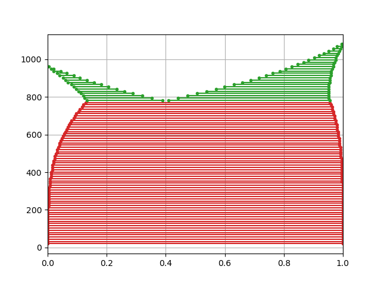
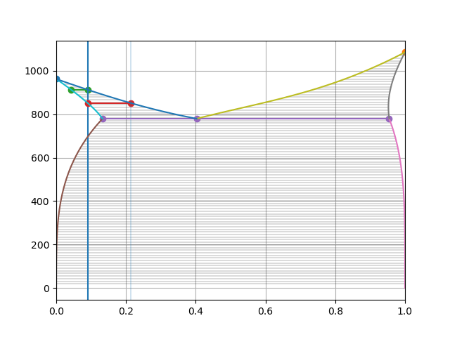

NFPL800 Excercise
=================

Plot CuAg phase diagram by brute force convex hull method.




Plot invariant equilibria by solving equlibrium equations. Trace phase boundaries.
```
Ag melting point 961.7795532622605
Cu melting point 1084.6199854338527
.............
Liquidus 0.04245288466265213 0.09 912.4762124401511
................
Solidus 0.09 0.21369526455951235 851.1059357223562
......................
Eutectic point 0.13272305627978498 0.9546058274141793 0.4025244602393358 779.140887553754
```




Free databases:
---------------
* [SGTE Pure Element Database](https://www.sgte.net/en/free-pure-substance-database)
* [NIST Solder Systems](https://www.metallurgy.nist.gov/phase/solder/solder.html)
* COST 507: Thermochemical Database for Light Metal Alloys 


Credit ideas:
-------------
* ternary system (isothermal section, vertical section, liquidus projection, 3D plot)
* more complex real system (fixed composition phases, more complex models: SRO, LRO)
* equation for phase boundaries (like Clausius–Clapeyron) 
