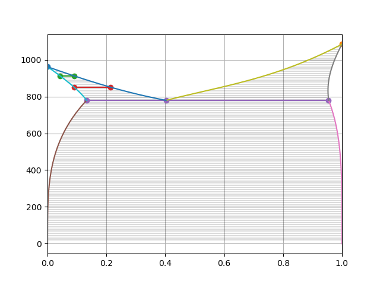

NFPL800 Excercise
=================

Plot CuAg phase diagram by brute force convex hull method.

Free databases:
---------------
* [SGTE Pure Element Database](https://www.sgte.net/en/free-pure-substance-database)
* [NIST Solder Systems](https://www.metallurgy.nist.gov/phase/solder/solder.html)
* COST 507: Thermochemical Database for Light Metal Alloys 

Credit ideas:
-------------
* ternary system (isothermal section, vertical section, liquidus projection, 3D plot)
* more complex real system (fixed composition phases, more complex models: SRO, LRO)
* equation for phase boundaries (like Clausius–Clapeyron) 
